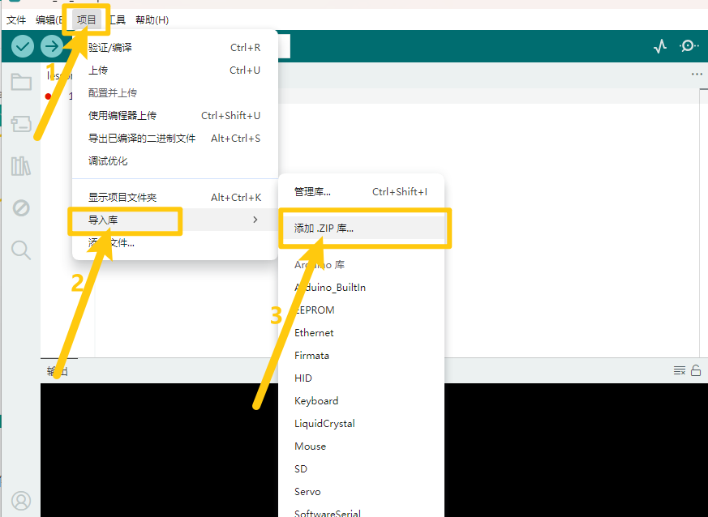

# Arduino


## 1. Arduino简介  

Arduino是一种开源电子原型平台，广泛应用于电子和编程学习。它由硬件和软件组成，硬件包括一系列开发板，如Arduino UNO和MEGA。Arduino IDE是用于编写和上传代码的集成开发环境，支持多种编程语言，包括Arduino C。通过丰富的传感器和模块，Arduino可以轻松实现多种项目，如机器人控制、智能家居、传感器监测等。Arduino的用户社区活跃，提供丰富的教程和项目参考，是初学者和爱好者学习电子和编程的理想选择。  

## 2. 接线图  

  

## 3. 测试代码

- 下载文件：[Arduino](./Arduino.7z)

- 打开Arduino IDE，选择“项目”，选择“导入库”，再选择“添加.ZIP库”。

  

- 找到下载资料的存放位置，打开文件夹找到库文件，选择要导入的库，点击“打开”。

  

-   安装成功出现的界面。

  

```cpp  
#include <IRremote.h>  

int RECV_PIN = 11; // 定义数字口11  
IRrecv irrecv(RECV_PIN);  
decode_results results;  

void setup() {  
    Serial.begin(9600); // 设置波特率  
    irrecv.enableIRIn(); // 使能红外接收  
}  

void loop() {  
    if (irrecv.decode(&results)) {  
        Serial.println(results.value, HEX); // 显示数据  
        irrecv.resume(); // 接收下个数据  
    }  
}  
```

## 4. 代码说明  

编译上传之前，我们需要先导入库文件`IRremote.h`。下图是红外遥控的键值：  

  

## 5. 测试结果  

按照接线图接线后，上传测试代码成功。利用USB线接通电源后，打开串口监视器，里面会显示红外接收传感器接收到的数据。对准红外接收传感器的接收头按下按键，接收到信号后，红外接收传感器上的LED也开始闪烁，串口监视器显示如下图。  


