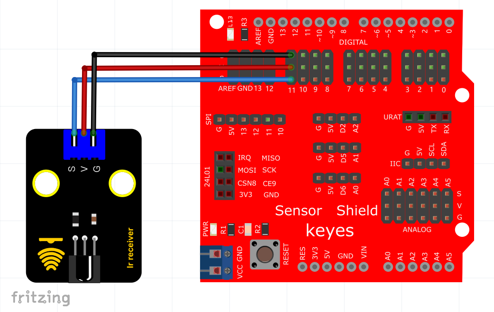
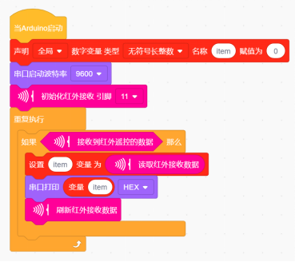
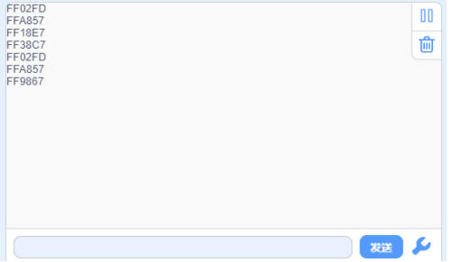

# KidsBlock

## 1. KidsBlock简介  

KidsBlock是一款面向儿童及初学者的图形化编程软件，旨在通过易于理解的界面和拖拽式的编程方式，使学习编程变得简单而有趣。它支持多种硬件平台，如Arduino，使学生能够通过实操项目学习编程和电子知识。KidsBlock具有丰富的教学材料和示例项目，让用户在实践中提升动手能力和逻辑思维。通过KidsBlock，用户可以轻松创建互动应用、游戏和其他创意项目，使编程学习充满乐趣。  

## 2. 接线图  

## 3. 测试代码（测试软件版本：KidsBlock Desktop 1.1.2）  

  

## 4. 代码说明  

下图是红外遥控的键值：  

  

## 5. 测试结果  

按照接线图接线并上传测试代码成功后，利用USB线供电，打开串口监视器，接收到的数据显示在监视器中。当对准红外接收传感器的接收头按下遥控器按键时，红外接收传感器上的LED也开始闪烁。串口监视器的显示效果如图所示。  

