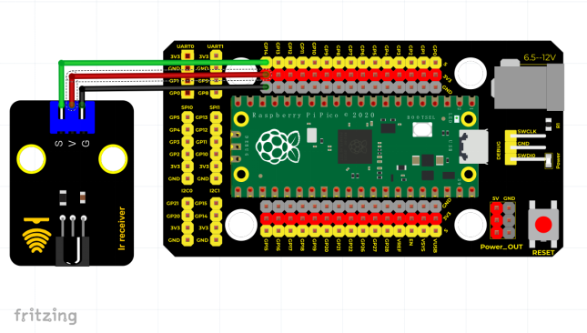
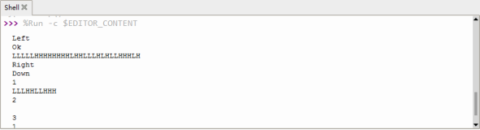

# Python


## 1. Python简介  

Python是一种高级编程语言，因其简洁的语法和强大的功能而受到广泛欢迎。它通常被用于web开发、数据分析、人工智能、机器学习、自动化和科学计算等众多领域。Python的设计理念强调代码的可读性和简洁性，使得编写和维护代码变得更加高效。由于其丰富的库和社区支持，Python成为初学者学习编程的首选语言之一，同时也被许多大型项目和企业所采用。  

## 2. 接线图  



## 3. 测试代码（测试软件版本：Thonny 3.3.3）  

```python  
import utime  
from machine import Pin  

ird = Pin(14, Pin.IN)  

act = {  
    "1": "LLLLLLLLHHHHHHHHLHHLHLLLHLLHLHHH",  
    "2": "LLLLLLLLHHHHHHHHHLLHHLLLLHHLLHHH",  
    "3": "LLLLLLLLHHHHHHHHHLHHLLLLLHLLHHHH",  
    "4": "LLLLLLLLHHHHHHHHLLHHLLLLHHLLHHHH",  
    "5": "LLLLLLLLHHHHHHHHLLLHHLLLHHHLLHHH",  
    "6": "LLLLLLLLHHHHHHHHLHHHHLHLHLLLLHLH",  
    "7": "LLLLLLLLHHHHHHHHLLLHLLLLHHHLHHHH",  
    "8": "LLLLLLLLHHHHHHHHLLHHHLLLHHLLLHHH",  
    "9": "LLLLLLLLHHHHHHHHLHLHHLHLHLHLLHLH",  
    "0": "LLLLLLLLHHHHHHHHLHLLHLHLHLHHLHLH",  
    "Up": "LLLLLLLLHHHHHHHHLHHLLLHLHLLHHHLH",  
    "Down": "LLLLLLLLHHHHHHHHHLHLHLLLLHLHLHHH",  
    "Left": "LLLLLLLLHHHHHHHHLLHLLLHLHHLHHHLH",  
    "Right": "LLLLLLLLHHHHHHHHHHLLLLHLLLHHHHLH",  
    "Ok": "LLLLLLLLHHHHHHHHLLLLLLHLHHHHHHLH",  
    "*": "LLLLLLLLHHHHHHHHLHLLLLHLHLHHHHLH",  
    "#": "LLLLLLLLHHHHHHHHLHLHLLHLHLHLHHLH"  
}  

def read_ircode(ird):  
    wait = 1  
    complete = 0  
    seq0 = []  
    seq1 = []  

    while wait == 1:  
        if ird.value() == 0:  
            wait = 0  

    while wait == 0 and complete == 0:  
        start = utime.ticks_us()  
        
        while ird.value() == 0:  
            ms1 = utime.ticks_us()  
            diff = utime.ticks_diff(ms1, start)  
            seq0.append(diff)  

        while ird.value() == 1 and complete == 0:  
            ms2 = utime.ticks_us()  
            diff = utime.ticks_diff(ms2, ms1)  
            if diff > 10000:  
                complete = 1  
            seq1.append(diff)  

    code = ""  
    for val in seq1:  
        if val < 2000:  
            if val < 700:  
                code += "L"  
            else:  
                code += "H"  

    command = ""  
    for k, v in act.items():  
        if code == v:  
            command = k  

    if command == "":  
        command = code  

    return command  

while True:  
    command = read_ircode(ird)  
    print(command)  
    utime.sleep(0.5)  
```

## 4. 代码说明  

`read_ircode(ird)`函数返回字典中的键，即对应遥控器上的按键符号。  

## 5. 测试结果  

使用红外遥控器对准红外接收传感器的接收头并按下按键后，红外接收传感器上的LED开始闪烁。如图所示。  




